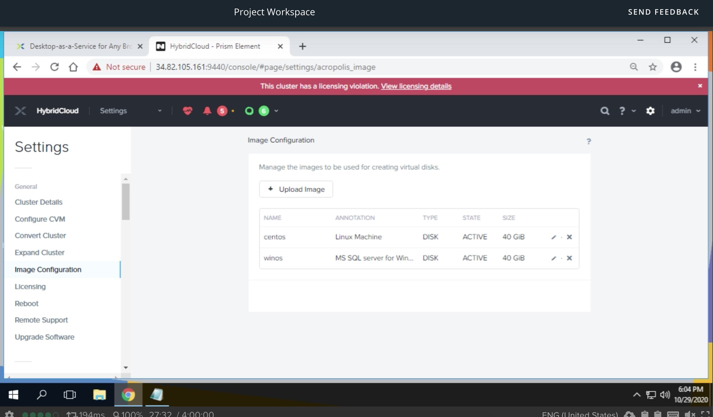
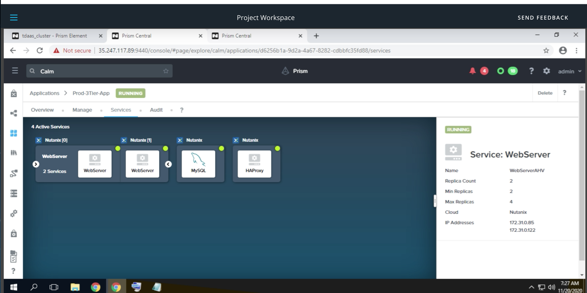
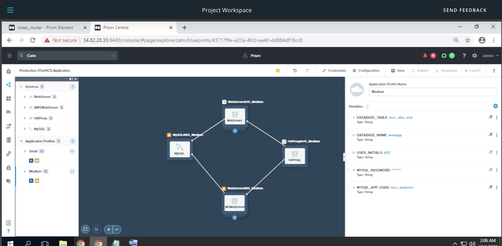

# Hybrid Cloud Engineer Nanodegree (HCEND), Udacity
I was one of the 300 HCEND recipients chosen from the 3,000 participants in the _**Nutanix Hybrid Cloud Scholarship Program**_. This repo contains a collection of project deliverables from my HCEND course work. 
 ---

_*Project artifacts are stowed in secured storage to discourage improper access. For legitimate needs, please email to request access*_.  

## Project Deliverables Summary
### 1. [Private Cloud Web Application Infrastructure](https://github.com/atan4583/hcend-project-portfolio/tree/master/Project%201-Private%20Cloud%20Web%20Application%20Infrastructure)
> * Build a Hyperconverged private cloud solution for evaluating a three-tier a web application on a Nutanix HCI cluster. The web application should have a web server VM, application VM and database server VM and run in separate production and development environments. 
>
> * The production environment requires built-in data protection using backup/restore with snapshots and no more than 1 hour of data loss after a failure. Additional tests include VM workload expansion (cloning), the ability to dynamically add CPU/Memory resources to online virtual machines (add 1 vCPU and 2GB memory to the database server). Final verification is the removal of a key VM and performing a full restoration.
>
> * The configuration tasks performed on Prism Element are as shown in the screenshots below:
>
> Network configuration:
>
> 
> 
> Storage container configuration:
>
> 
>
> Image configuration:
>
> 
>
> Prod VM configuration:
> 
> 
>
> Dev VM configuration:
> 
> 
>
> Protection domain configuration:
> 
> 
>
> Restoration operation:
> 
> 
>
>
> * Infrastructure specification: refer to this [rubric](https://github.com/atan4583/hcend-project-portfolio/blob/master/Project%201-Private%20Cloud%20Web%20Application%20Infrastructure/rubric.pdf) 
>
>
> * Tool: Nutanix Prism Element, Configuration Documenter, Microsoft Excel, Notepad
>
>
> * Artifact: [Audrey_Tan-HybridCloud-Nutanix_Cluster_as_Built_2020-10-30_120406.xlsx](https://drive.google.com/file/d/1dsfWQ6-HD8xrThbLoUihq6h43NGqDuI5/view?usp=sharing), Email_to_CTO.txt
>
>
> 
 ---
### 2. [Private Cloud SaaS Three-Tier Web Application](https://github.com/atan4583/hcend-project-portfolio/tree/master/Project%202-Private%20Cloud%20SaaS%20Three-Tier%20Web%20Application)
> * Design a blueprint to deploy and configure a three-tier web application with a load balancer, web server and database VM hosted on the private cloud
>
> * Insure each VM in configured with the proper resources and tasks.
>
> * Test the deployment works with a read and write to the database.
>
> * Test web tier scaling: scale-in and scale-out actions changing the population by a count of 1.
>
> * Allow an end user to make a database backup.
>
> A graphical view of the blueprint is as shown below:
>
> 
> 
> The blueprint can be used to launch a three-tier web application from within Nutanix Calm via a GUI interface:
>
> 
>
> On successfully launched, a three-tier web application with a load balancer, web server and database server is as shown below:
>
> 
>
> The web tier of the web application can be scaled up as shown:
>
>  
>
>
> * Blueprint specification: refer to this [rubric](https://github.com/atan4583/hcend-project-portfolio/blob/master/Project%202-Private%20Cloud%20SaaS%20Three-Tier%20Web%20Application/rubric.pdf)
> 
> * Tool: Nutanix Prism Central and Calm (Clour Application Lifecycle Management)
>
>
> * Artifact: [Production-3Tier-Application.json](https://drive.google.com/file/d/150AtKfG2fY0JYlj9NAAlSt1KOS6OQNPK/view?usp=sharing)
>
>
>
 ---
### 3. [Hybrid Cloud SaaS Three-Tier Web Application](https://github.com/atan4583/hcend-project-portfolio/tree/master/Project%203-Hybrid%20Cloud%20SaaS%20Three-Tier%20Web%20Application)
> * Design a blueprint to deploy and configure a three tier web application with a load balancer hosted on the private cloud, two web server tiers (each hosted on a private and a public cloud)
>
> * Insure each VM in configured with the proper resources and tasks
> 
> * Test the deployment works with a read and write to the database.
>
> * Test web tier scaling: scale-in and scale-out actions changing the population by a count of 1 on private cloud separately from scaling on the public cloud.
>
> * Allow self-service, ad-hoc backup of the database.
> 
> * Create two application profiles for deployment for a small (1 vCPU, 1 core, 1GB RAM or t2.micro) and medium (2vCPU, 2 cores, 1GB RAM or t2.micro) CPU and memory configuration variants.
>
> A graphical view of a small and medium blueprints are as shown below:
>
> 
> 
>
> Both blueprint can be used to launch a three-tier hybrid cloud web application from within Nutanix Calm via a GUI interface:
> 
> 
> 
> 
> On successfully launched, a small and medium three-tier hybrid cloud web application are as shown below:
> 
> 
> 
>
> The private cloud web tier of the small and medium web applications can be scaled up as shown:
> 
> 
> 
>
> The public cloud web tier of the small and medium web applications can be scaled up as shown:
> 
> 
> 
>
>
> * Blueprint specification: refer to this [rubric](https://github.com/atan4583/hcend-project-portfolio/blob/master/Project%203-Hybrid%20Cloud%20SaaS%20Three-Tier%20Web%20Application/rubric.pdf)
>
>
> * Tool: Nutanix Prism Central and Calm (Clour Application Lifecycle Management)
>
>
> * Artifact: [Production-HCS-3Tier-Application.json](https://drive.google.com/file/d/1FD8Y-I6INjkVK-RsS6JYdWXqo70DFHsR/view?usp=sharing)
>
>
> 
 ---
>
>
